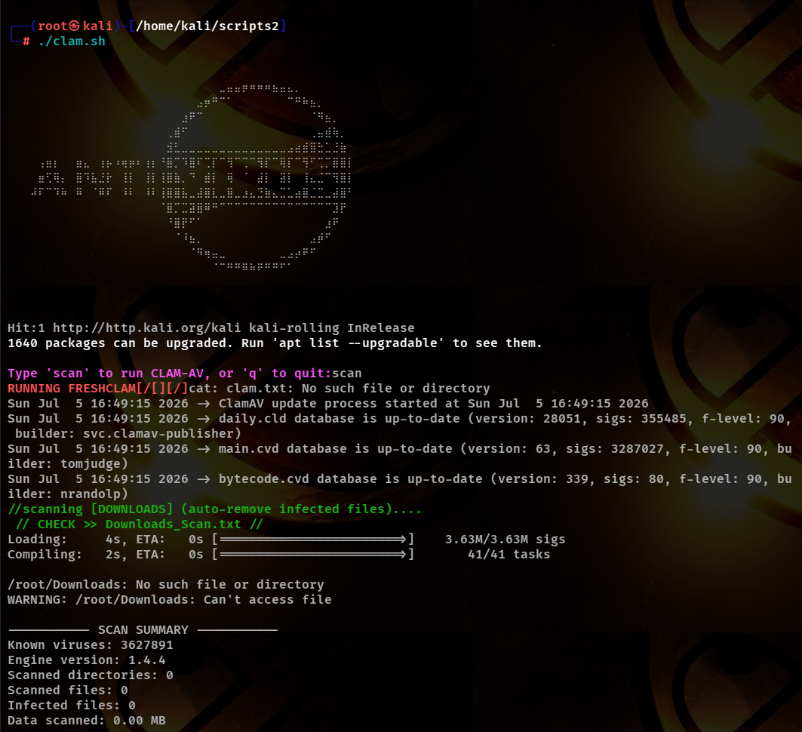

# ClamAV Auto Scan

Automated antivirus scanning tool using ClamAV for Linux systems. This script provides automated virus detection and removal capabilities with interactive control.



## Overview

ClamAV Auto Scan is a bash-based utility that simplifies malware detection and removal on Linux systems. It automates the setup, updating, and scanning of critical system directories using ClamAV (an open-source antivirus engine).

## Features

- Automatic ClamAV installation and configuration
- Interactive command interface
- Real-time virus signature updates via freshclam
- Targeted scanning of Downloads, home directory, and temporary directories
- Automatic removal of infected files
- Comprehensive logging of scan results
- Color-coded output for easy readability

## Requirements

- Linux operating system (Ubuntu/Debian-based)
- Sudo privileges (required for package installation and system scanning)
- Bash shell
- Internet connection (for downloading virus definitions)

## Installation

1. Clone the repository:
```bash
git clone https://github.com/Deathrider-IX/clam-av-auto-scan.git
cd clam-av-auto-scan
```

2. Make the script executable:
```bash
chmod +x clam.sh
```

3. Run the script:
```bash
./clam.sh
```

## Usage

Once the script is running, you will be presented with an interactive prompt:

```
Type 'scan' to run CLAM-AV, or 'q' to quit:
```

### Available Commands

- `scan`: Initiates a full scan cycle
  - Updates virus definitions
  - Scans Downloads directory (auto-removes infected files)
  - Scans home directory, /tmp, and /var/tmp
  - Displays scan results and exit codes
  
- `q` or `quit`: Exits the application

### What Happens During a Scan

1. **Freshclam Update**: Updates ClamAV virus definitions to the latest version
2. **Downloads Scan**: Scans the Downloads directory with automatic removal enabled
3. **System Scan**: Scans home directory and temporary directories
4. **Reporting**: Displays exit codes indicating scan status

Exit codes:
- `0`: No viruses found
- `1`: Virus(es) found and cleaned
- Other values: Indicates warnings or errors during scanning

## File Structure

```
clam-av-auto-scan/
├── clam.sh              # Main application script
├── clam.txt             # ClamAV banner display
├── binary.txt           # Binary art/display file
└── README.md            # This file
```

## Important Notes

### Automatic File Removal

The script uses the `--remove` flag when scanning the Downloads directory. This means infected files will be automatically deleted without user confirmation. Use with caution.

### Directory Exclusions

The home directory scan explicitly excludes:
- `/proc` - Process information
- `/sys` - System information  
- `/dev` - Device files

These exclusions prevent scanning virtual filesystems that would cause errors.

### Sudo Requirements

The following operations require sudo privileges:
- Package installation
- ClamAV daemon management
- Scanning system-protected directories
- Freshclam updates

## Troubleshooting

### ClamAV Installation Fails
If package installation fails, the script will attempt to install with `--fix-missing` flag. You may need to manually run:
```bash
sudo apt update
sudo apt install -y clamav clamav-daemon
```

### Permission Denied Errors
Ensure the script is executable and you have sudo access:
```bash
chmod +x clam.sh
sudo ./clam.sh
```

### Freshclam Lock Error
If you encounter freshclam lock errors, stop the freshclam daemon first:
```bash
sudo systemctl stop clamav-freshclam
```

## Configuration

The working directory for logs is created at:
```
$HOME/clamav/
```

Scan results are generated in this directory. Log files and results are not automatically cleaned up, allowing for historical review of scan activities.

## Security Considerations

- Run this tool only on systems you trust and can monitor
- Review scan results regularly
- Keep system and ClamAV definitions updated
- Be cautious when enabling automatic file removal
- Consider backing up important files before running scans with removal enabled

## License

This project is open source and available without restrictions.

## Contributing

Contributions and improvements are welcome. Please feel free to submit issues or pull requests. See CONTRIBUTING.md for guidelines.
